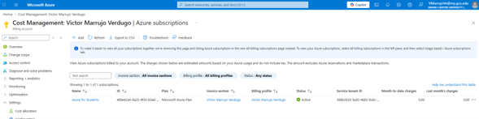
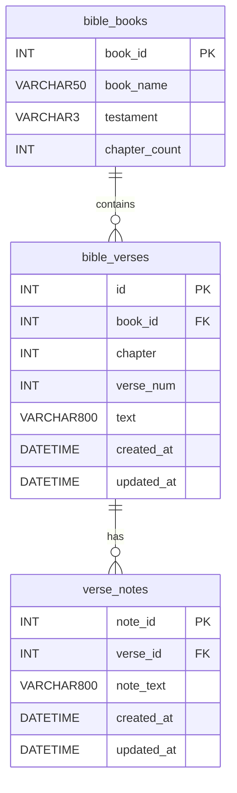
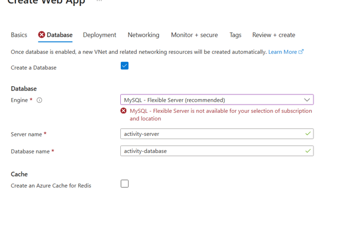
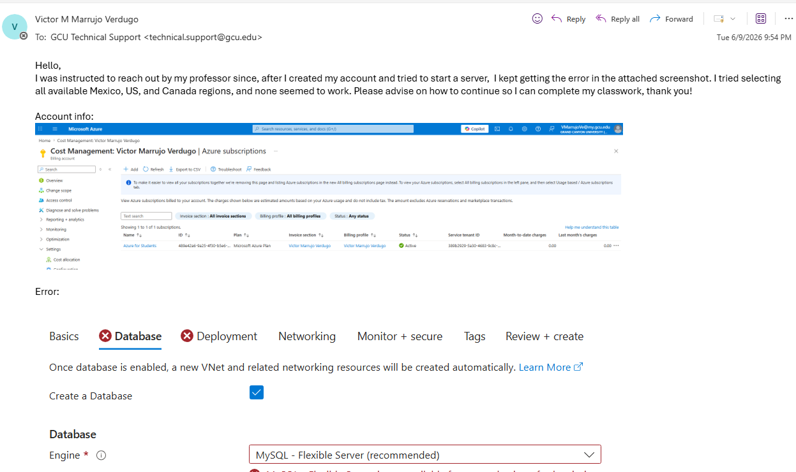
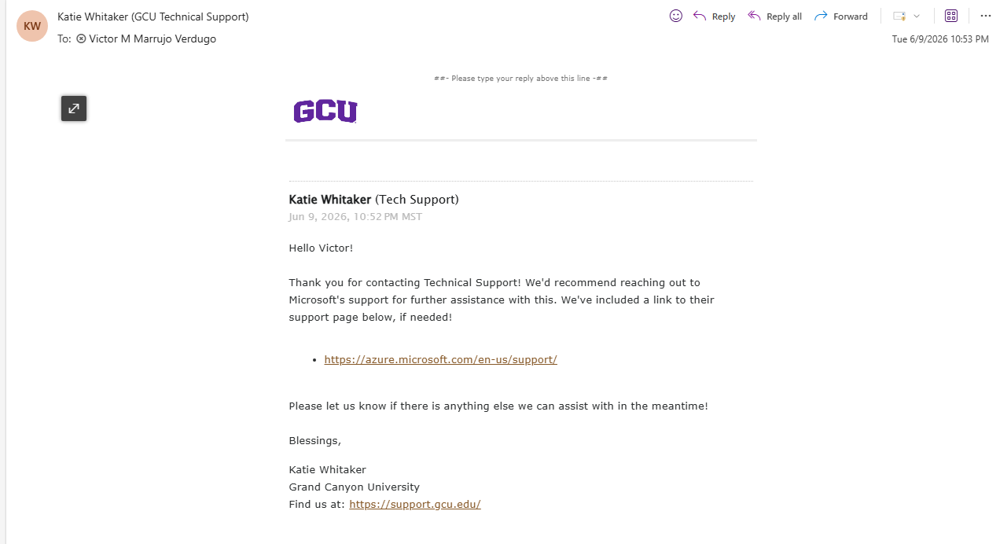
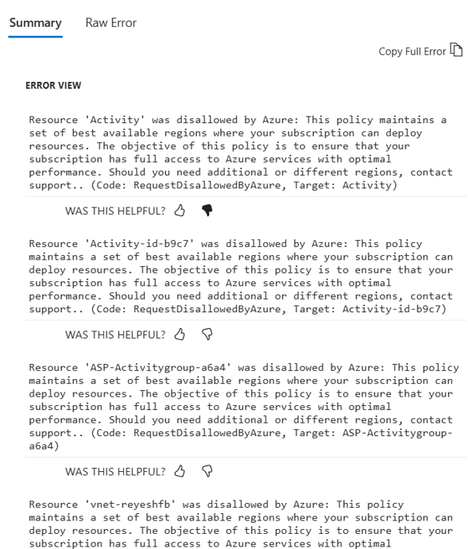

# CST-323: Cloud Computing
## Activity 1 - Design Cloud Test Application & Cloud Research
### Activity Report

---

| Field | Details |
|---|---|
| **Student** | Victor Manuel Marrujo Verdugo |
| **Course** | CST-323: Cloud Computing |
| **Professor** | Abdulaziz Alharbi |
| **Institution** | Grand Canyon University, College of Science, Engineering and Technology |
| **Date** | June 2026 |

---

## 1. Azure Portal Screenshot

> 

> Figure 1: Screenshot shows the Azure Portal Home → Subscriptions page confirming
> the **"Azure for Students"** subscription is active under the Offer column.

---

## 2. Technology Stack

| Component | Choice | Justification |
|---|---|---|
| **Framework** | PHP Laravel 11 | Required for BSCP program; MVC architecture separates concerns cleanly for CRUD development |
| **Runtime** | PHP 8.5 | Confirmed in Azure Web App Basics configuration |
| **Database** | MySQL 8 | Required by activity; relational model well-suited to structured Bible verse and notes data |
| **Logging** | Monolog (Laravel built-in) | Required PHP logging framework per BSCP spec; configured as a daily rotating log channel |
| **Frontend** | Blade Templates + Bootstrap 5 | Blade is Laravel's native templating engine; Bootstrap 5 delivered via CDN per activity requirements |
| **Cloud Host** | Microsoft Azure (Azure for Students) | Required by course; Web App + MySQL Flexible Server (deployment blocked - see Section 6) |
| **Version Control** | Git / GitHub | Required by activity; repository initialized during Laravel project creation |

---

## 3. Application Overview

The test application chosen for this activity is the **Bible Verse Searcher**, a web application
originally built as the Milestone Project for CST-391 (JavaScript Web Application Development)
using Node.js, Express, Angular, and React. For this course, the application has been
re-implemented from scratch using PHP Laravel 11, which is a technology I had no prior
experience with. PHP and the Laravel framework were entirely new to me coming into this
activity, and a significant portion of the development time was spent learning the language
fundamentals, Laravel's MVC architecture, Eloquent ORM, Blade templating, and the Artisan
command-line tooling before any application code could be written.

The decision to reuse the Bible Verse Searcher concept was intentional since the domain,
database schema, and CRUD requirements were already well understood from CST-391, which
allowed me to focus my learning effort on PHP and Laravel rather than simultaneously
designing a new application from scratch.

The application allows users to search, browse, create, update, and delete Bible verses,
as well as attach personal notes to individual verses. It is functional locally and meets
all Activity 1 technical requirements pending Azure cloud deployment.

**Requirements satisfied:**

- Full CRUD functionality across all three database tables
- 4 pages combining data entry forms and data display
- Bootstrap 5 styling via CDN
- Monolog logging on every controller action
- MySQL database with 3 related tables
- Git repository initialized with version history

---

## 4. Database Design - ER Diagram

The database schema was carried forward from CST-391 Milestones with no structural changes.
The same MySQL tables were reused to avoid redundant schema design and to allow focus on
learning the Laravel framework.

### 4.1 Tables

#### `bible_books`
| Column | Data Type | Constraints |
|---|---|---|
| book_id | INT | PK, NOT NULL |
| book_name | VARCHAR(50) | NOT NULL |
| testament | VARCHAR(3) | OT or NT, NOT NULL |
| chapter_count | INT | NOT NULL |

#### `bible_verses`
| Column | Data Type | Constraints |
|---|---|---|
| id | INT | PK, AUTO_INCREMENT |
| book_id | INT | FK → bible_books.book_id, CASCADE DELETE |
| chapter | INT | NOT NULL |
| verse_num | INT | NOT NULL |
| text | VARCHAR(800) | NOT NULL |
| created_at | DATETIME | DEFAULT CURRENT_TIMESTAMP |
| updated_at | DATETIME | ON UPDATE CURRENT_TIMESTAMP |

#### `verse_notes`
| Column | Data Type | Constraints |
|---|---|---|
| note_id | INT | PK, AUTO_INCREMENT |
| verse_id | INT | FK → bible_verses.id, CASCADE DELETE |
| note_text | VARCHAR(800) | NOT NULL |
| created_at | DATETIME | DEFAULT CURRENT_TIMESTAMP |
| updated_at | DATETIME | ON UPDATE CURRENT_TIMESTAMP |

### 4.2 ER Diagram

### 4.3 Relationships

- `bible_books` (1) ──► (many) `bible_verses` - One book contains many verses
- `bible_verses` (1) ──► (many) `verse_notes` - One verse can have many personal notes
- CASCADE DELETE enforced on both foreign keys, removing a book removes its verses;
  removing a verse removes all associated notes

### 4.4 Tables Build Status

| Table | Built | Notes |
|---|---|---|
| `bible_books` | ✅ Complete | Created and seeded with 8 sample books |
| `bible_verses` | ✅ Complete | Created and seeded with 9 sample verses |
| `verse_notes` | ✅ Complete | Created; notes added via application at runtime |

---

## 5. Application Progress

### 5.1 Application Flow

```mermaid
flowchart TD
    A([" / — Root"]) --> B
 
    B["📖 Verse List\nGET /verses\nSearch · Filter · Delete"]
 
    B --> C["➕ Add Verse\nGET /verses/create\nPOST /verses"]
    B --> D["🔍 Verse Detail\nGET /verses/{id}"]
    B -->|inline| E["🗑 Delete Verse\nDELETE /verses/{id}"]
 
    D --> F["✏️ Edit Verse\nGET /verses/{id}/edit\nPUT /verses/{id}"]
    D --> G["📝 Add Note\nPOST /verses/{id}/notes"]
    D --> H["🗑 Delete Note\nDELETE /verses/{id}/notes/{note}"]
 
    C -->|redirect on save| B
    F -->|redirect on save| D
    E -->|redirect| B
    G -->|redirect| D
    H -->|redirect| D
 
    style A fill:#6c757d,color:#fff
    style B fill:#0d6efd,color:#fff
    style C fill:#198754,color:#fff
    style D fill:#0dcaf0,color:#000
    style E fill:#dc3545,color:#fff
    style F fill:#ffc107,color:#000
    style G fill:#198754,color:#fff
    style H fill:#dc3545,color:#fff
```
 

### 5.2 Pages Built

| Page | Route | CRUD Operation | Status |
|---|---|---|---|
| Verse List | `GET /verses` | Read All + Search + Filter + Delete | ✅ Complete |
| Verse Detail | `GET /verses/{id}` | Read One + Notes CRUD | ✅ Complete |
| Add Verse | `GET /verses/create` | Create | ✅ Complete |
| Edit Verse | `GET /verses/{id}/edit` | Update | ✅ Complete |

### 5.3 Backend Components Built

| Component | File | Status |
|---|---|---|
| VerseController | `app/Http/Controllers/VerseController.php` | ✅ Complete |
| BibleBook Model | `app/Models/BibleBook.php` | ✅ Complete |
| BibleVerse Model | `app/Models/BibleVerse.php` | ✅ Complete |
| VerseNote Model | `app/Models/VerseNote.php` | ✅ Complete |
| Web Routes | `routes/web.php` | ✅ Complete |
| Blade Layout | `resources/views/layouts/app.blade.php` | ✅ Complete |
| Monolog Config | `config/logging.php` | ✅ Complete |
| Database Schema | MySQL Workbench (from CST-391) | ✅ Complete |

### 5.4 Items Remaining

| Item | Reason Pending |
|---|---|
| Azure cloud deployment | Blocked by subscription policy errors - see Section 6 |
| `.env` Azure database connection | Pending resolution of Azure deployment issue |
| Inline note editing | Deferred to a future activity iteration |

---

## 6. Current Completion Issues

Two distinct Azure errors were encountered during this activity, both of which blocked
cloud deployment. All issues were documented.

---

### Issue 1 - MySQL Flexible Server Unavailable (All Regions)

> Figure 2: Screenshot shows the Azure Portal Error Message

**Error Message:**
> *"MySQL - Flexible Server is not available for your selection of subscription and location."*

**Subscription:** Azure for Students (GCU-provided)

**Regions Attempted:** All available regions were tried through the Azure Web App + Database
creation wizard. The error persisted in every region without exception, confirming this is
a subscription-level restriction rather than a regional availability issue.

**Professor Response:** Professor Alharbi confirmed via email that this is a known restriction
of the GCU Azure for Students subscription and advised contacting GCU IT Support, continuing
all non-deployment work in parallel, and documenting the issue thoroughly in this report.

**Resolution Steps Taken:**

 
> Figure 3 - Email sent to GCU support

**Step 1 - GCU IT Support contacted.** Following the professor's guidance, GCU Technical
Support was contacted via email on Tuesday, June 9, 2026 at 9:54 PM, including a description
of the issue, Azure subscription account information showing the active "Azure for Students"
plan, and a screenshot of the MySQL Flexible Server error.
 
 
> Figure 4 - Email recived from GCU support
**Step 2 - GCU IT Support response received.** GCU Technical Support (Katie Whitaker)
responded the same evening at 10:53 PM MST. The response acknowledged the issue but did
not resolve the subscription restriction, instead redirecting to Microsoft's own support
channels.
 
**Step 3 - Microsoft documentation reviewed.** Per Microsoft Azure IT Support's direction, the
following official Microsoft resources were consulted to understand the subscription
service limits and MySQL Flexible Server regional availability:
 
- Azure Subscription Service Limits:
  https://learn.microsoft.com/en-us/azure/azure-resource-manager/management/azure-subscription-service-limits
- MySQL Flexible Server — Azure Regions Overview:
  https://learn.microsoft.com/en-us/azure/mysql/flexible-server/overview#azure-regions

From mmy understanding of the documentation, MySQL Flexible Server availability varies by subscription
tier and region. The Azure for Students subscription provided through GCU does not include
MySQL Flexible Server provisioning rights in any of the regions attempted, which is
consistent with the errors encountered across all Mexico, US, and Canada regions.
 
**Impact:** The MySQL Flexible Server database cannot be provisioned under this subscription
tier in any available region. The application is fully functional locally using a local
MySQL 8 instance and is ready for cloud deployment the moment the subscription restriction
is resolved.

---

### Issue 2 - Azure Policy Blocking All Resource Deployment

**Error Code:** `RequestDisallowedByPolicy`
 
 
> Figure 5 - RequestDisallowedByPolicy

**Affected Resources:**
- `Activity` (Web App) - disallowed by Azure policy
- `Activity-id-b9c7` (App Service Plan) - disallowed by Azure policy
- `ASP-Activitygroup-a6a4` (App Service Plan) - disallowed by Azure policy
- `vnet-reyeshfb` (Virtual Network) - disallowed by Azure policy

**Full Error Message (representative):**
> *"Resource 'Activity' was disallowed by Azure: This policy maintains a set of best
> available regions where your subscription can deploy resources. The objective of this
> policy is to ensure that your subscription has full access to Azure services with optimal
> performance. Should you need additional or different regions, contact support.
> (Code: RequestDisallowedByPolicy)"*

**Root Cause:** The Azure for Students subscription provided through GCU enforces a
region policy that restricts which Azure regions are available for resource deployment.
Every region attempted triggered this policy restriction, preventing the Web App, App
Service Plan, and associated networking resources from being created entirely, separate
from the MySQL Flexible Server issue.

**Impact:** As a result of both Issue 1 and Issue 2, the application could not be deployed
to Azure at any point during this activity. The application is fully functional in the
local development environment using XAMPP and a local MySQL 8 instance.

**Steps Taken to Resolve:**
1. Attempted all available regions in the Azure portal
2. Documented both errors with full screenshots
3. Messaged Professor Alharbi with screenshots

---

## 7. Screencast URL

> **[INSERT LOOM OR YOUTUBE URL HERE]**
>
> The screencast demonstrates the following locally-running functionality:
> 1. Application loading at `http://localhost:8000`
> 2. Verse List page with keyword search and testament filter
> 3. Adding a new verse via the Add Verse form (Create)
> 4. Viewing verse details (Read)
> 5. Editing an existing verse (Update)
> 6. Deleting a verse with confirmation (Delete)
> 7. Adding a personal note to a verse
> 8. Deleting a note

---

## 8. Cloud Computing Research

### Question 1 - Evolution of Cloud Computing (75–100 words)

Cloud computing is the result of technology evolving through several different stages. It started with mainframe computers, where everything was controlled from one central system. Then came the client-server era, which gave developers more flexibility and allowed applications to be created faster, but also created security and management challenges. The Internet era connected businesses and customers around the world, making technology more accessible but also more complex. Cloud computing combines the strengths of all three by offering centralized management, flexible resources, and global access through the Internet while allowing businesses to pay only for what they use.

---

### Question 2 - Case Study Analysis

> Selected Case Study: Netflix

#### Three Advantages

1. **On-demand scalability** - One of the biggest advantages Netflix gained from moving to the cloud was the ability to scale resources up or down depending on user demand. This allowed the company to handle traffic spikes without purchasing additional hardware.

2. **Lower Infrastructure Costs** - Instead of constantly investing in servers and maintaining data centers, Netflix could use cloud resources as needed. This helped reduce costs and allowed the company to focus more on improving its streaming platform.

3. **Focus on Core Business Goals** - By letting AWS manage much of the infrastructure, Netflix's engineering teams could spend more time developing features and improving the customer experience rather than maintaining hardware.

#### Three Disadvantages

1. **Dependence on a Cloud Provider**- Since Netflix relies heavily on AWS, any service disruptions or major pricing changes could potentially impact the company.

2. **Security and Compliance Concerns** - Even though cloud providers offer strong security features, companies must still ensure customer data is protected and that industry regulations are followed.

3. **Complex Migration Process** - Moving from an on-premises environment to the cloud required significant planning, testing, and redesigning of systems to ensure services continued running smoothly.

#### Challenges Faced

One of the biggest challenges Netflix faced was migrating existing systems from its own data centers to the cloud while keeping services available for customers. The company also needed to redesign parts of its architecture to take advantage of cloud technologies and ensure applications could scale efficiently. In addition, teams had to learn new cloud tools and processes while managing the transition without disrupting business operations.

#### Three Cloud Features Leveraged

1. **Auto-scaling**- Netflix uses auto-scaling to automatically add or remove computing resources based on current demand, helping maintain performance during periods of heavy traffic.

2. **Managed Cloud Infrastructure** - AWS manages much of the underlying infrastructure, reducing the amount of maintenance work required by Netflix engineers.

3. **Global Cloud Availability** - Netflix benefits from AWS's worldwide infrastructure, allowing content and services to be delivered efficiently to users in different regions.

---

### Question 3 - Cloud vs. On-Premise Recommendation (100+ words)

Based on the examples discussed in Chapter 1, I would recommend using a cloud solution instead of an on-premises solution for most modern business applications. The cloud provides flexibility, scalability, and lower upfront costs because companies only pay for the resources they use. The chapter showed how cloud services allowed businesses to quickly test ideas, launch applications, and grow without purchasing expensive hardware or building data centers.

Another advantage is that cloud providers handle much of the infrastructure management, updates, and maintenance, allowing development teams to focus on creating and improving applications. Cloud platforms also provide security features, backup options, and the ability to scale resources when demand increases. For a project like the Bible Verse Searcher application, a cloud solution would make deployment easier and provide the flexibility needed for future growth without requiring the management of physical servers. For these reasons, I believe a cloud-based approach is the better option for most organizations today.

---

*End of Activity 1 Report - Victor Manuel Marrujo Verdugo - CST-323 Cloud Computing - Prof. Abdulaziz Alharbi*