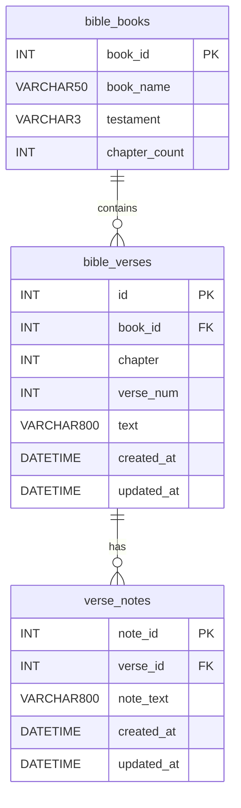
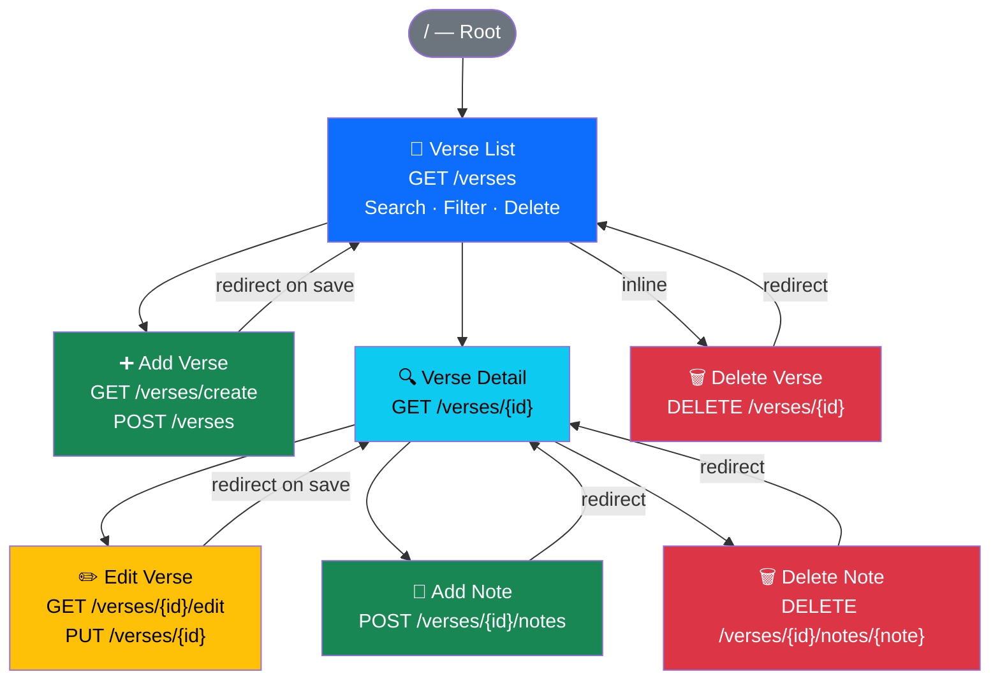

# CST-323: Cloud Computing
## Activity 2 — Build Cloud Test Application & Cloud Research
### Activity Report

---

| Field | Details |
|---|---|
| **Student** | Victor Manuel Marrujo Verdugo |
| **Course** | CST-323: Cloud Computing |
| **Professor** | Abdulaziz Alharbi |
| **Institution** | Grand Canyon University, College of Science, Engineering and Technology |
| **Date** | June 2026 |

---

## 1. Updated Application Design

The Bible Verse Searcher application built in Activity 1 is fully complete and meets all
requirements carried forward into Activity 2. No structural changes were made to the
database schema or application architecture. The application is running locally using
PHP Laravel 11 and MySQL 8, with Azure cloud deployment still pending resolution of the
subscription policy errors documented in Activity 1.

### 1.1 Application Summary

| Requirement | Status |
|---|---|
| PHP Laravel framework (BSCP requirement) | ✅ Complete |
| MySQL database | ✅ Complete |
| 3–4 pages with forms and data display | ✅ Complete — 4 pages |
| Full CRUD support | ✅ Complete |
| Bootstrap 5 styling | ✅ Complete |
| Git repository | ✅ Complete |
| Monolog logging | ✅ Complete |
| Screencast demonstration | ✅ Complete — see Section 2 |

### 1.2 Database Design (Unchanged from Activity 1)

#### ER Diagram

#### Table Status

| Table | Status | Notes |
|---|---|---|
| `bible_books` | ✅ Complete | 8 sample books seeded |
| `bible_verses` | ✅ Complete | 9 sample verses seeded |
| `verse_notes` | ✅ Complete | Created via application at runtime |

### 1.3 Application Flow

### 1.4 Pages and Components

| Page | Route | CRUD | Status |
|---|---|---|---|
| Verse List | `GET /verses` | Read All + Search + Delete | ✅ Complete |
| Verse Detail | `GET /verses/{id}` | Read One + Notes CRUD | ✅ Complete |
| Add Verse | `GET /verses/create` | Create | ✅ Complete |
| Edit Verse | `GET /verses/{id}/edit` | Update | ✅ Complete |

| Component | File | Status |
|---|---|---|
| VerseController | `app/Http/Controllers/VerseController.php` | ✅ Complete |
| BibleBook Model | `app/Models/BibleBook.php` | ✅ Complete |
| BibleVerse Model | `app/Models/BibleVerse.php` | ✅ Complete |
| VerseNote Model | `app/Models/VerseNote.php` | ✅ Complete |
| Web Routes | `routes/web.php` | ✅ Complete |
| Blade Layout | `resources/views/layouts/app.blade.php` | ✅ Complete |
| Monolog Config | `config/logging.php` | ✅ Complete |

---

*End of Activity 2 Report — Victor Manuel Marrujo Verdugo — CST-323 Cloud Computing — Prof. Abdulaziz Alharbi*